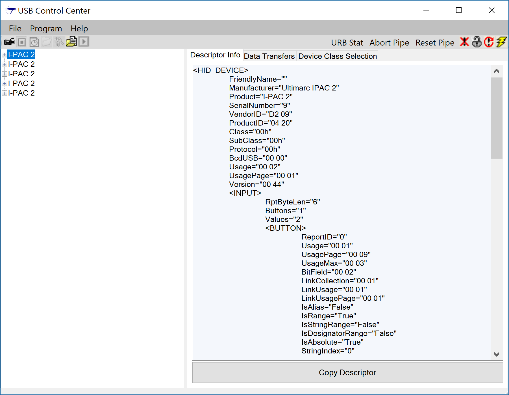

## Cypress USB Suite

This repository contains the source for a modified version of the Cypress USB
Suite, derived from the Cypress version 3.4.7 release.

This release contains several tools, including the USB Control Center, a C#
Bulk Loop utility, and a C# data streamer.

### Cypress USB Control Center

This utility permits easy management of Cypress FX2 and FX3 devices, as well
as devices which comply with Human Interface Device (HID) standards.  The
version in this repository has some enhanced functionality and has been updated
to work with newer devices and newer versions of windows.

The USB Control Center makes it easy to view HID devices, export their
descriptors as XML, and transfer data to and from USB endpoints.

